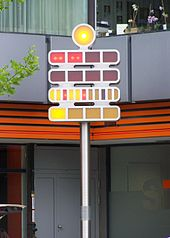

#   Katas

##  What a kata?
>   a [kata](http://butunclebob.com/ArticleS.UncleBob.TheBowlingGameKata) study it as a form, not as a conclusion. It is not the conclusion of the kata that matters, it's the steps that lead to the conclusion. If you want to lean to think the way I think, to design the way I design, then you must learn to react to minutia the way I react. Following this form will help you to do that. As you learn the form, and repeat it, and repeat it, you will condition your mind and body to respond the way I respond to the minute factors that lead to design decisions.

##  [删除有序数组中的重复元素](src/test/java/com/selonj/katas/UniqueOrderedArrayTest.java)

伪代码:
```pseudo-code
unique([1,1,2,2,3,3])==[1,2,3]
```

##  [求解一个数的素因数](src/test/java/com/selonj/katas/PrimeFactorsTest.java)

伪代码:
```pseudo-code
PrimeFactors.of(30)==[2,3,5]
```

## [保龄球游戏](src/test/java/com/selonj/katas/BowlingGameTest.java)


> 保龄球一局分为10轮,每轮有两次投球的机会来击倒10个球瓶,通过击倒的瓶数多少来计分.

**计分规则：**

- 一轮如果未全部击倒球瓶,则该轮计分为击倒的瓶数.如：第一轮第一次击倒1个,第二次击倒4个,该轮得分为5分
- 一轮中第一次击倒所有球瓶,即**全中**,该轮取消第二次投球,并把接下来两次投球击倒瓶数作为该轮的奖励,如：第5轮第一次击倒10个,下轮两次分别击倒0和1个球瓶,该轮得分为11分
- 一轮中两次击倒所有球瓶,即**补中**,并把接下来的一次投球击倒瓶数作为该轮的奖励,如：第3轮击倒10个,下轮两次分别击倒5和5个球瓶,该轮计分为15分.
-  在10轮中,如果投得全中,仍要继续投完最后两个球;如果是补中,就要继续投完最后一球,结束全局.

## [比较字符串排列是否同一排列](src/test/java/com/selonj/katas/StringPermutationTest.java)

伪代码:
```pseudo-code
permutation?('abc','bca')==true
permutation?('abc','bac')==false
permutation?('good','odgo')==true
```

## [版本号比较](src/test/java/com/selonj/katas/VersionComparisonTest.java)

伪代码:
```pseudo-code
'3.1.2'.compare('3.1')== 1
'12.0.0'.compare('11.0.0')== -1
'11.0.0'.compare('11')==0
```

## [建造URL中的queryString](src/test/java/com/selonj/katas/QueryStringTest.java)


伪代码:
```pseudo-code
QueryString.within(param('foo','bar'),param('key','value')).toString() == ?foo=bar&key=value
```

## BerlinClock 
[](https://en.wikipedia.org/wiki/Mengenlehreuhr)

[BerlinClock](https://en.wikipedia.org/wiki/Mengenlehreuhr)是首个使用着色的指示灯来显示时间。

-   前两排指示灯用来显示小时，后两排指示灯显示分钟。
-   第一排的4个红色指示灯每个表示5小时；
-   第二排的4个红色指示灯每个表示1小时；
-   第三排的11个红/黄色指示灯每个表示5分钟（15、30和45分钟的指示灯为红色）；
-   最后一排的4个黄色指示灯每个表示1分钟；